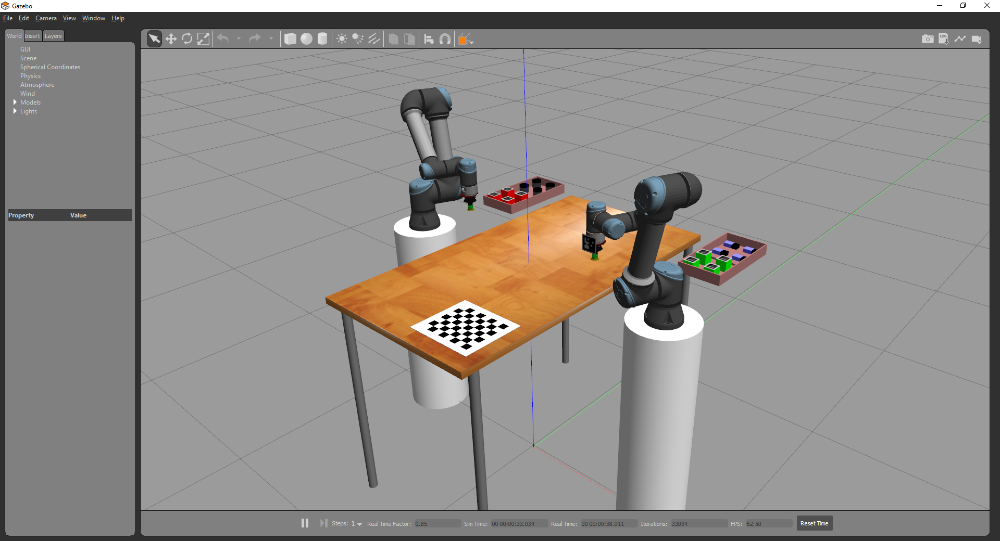
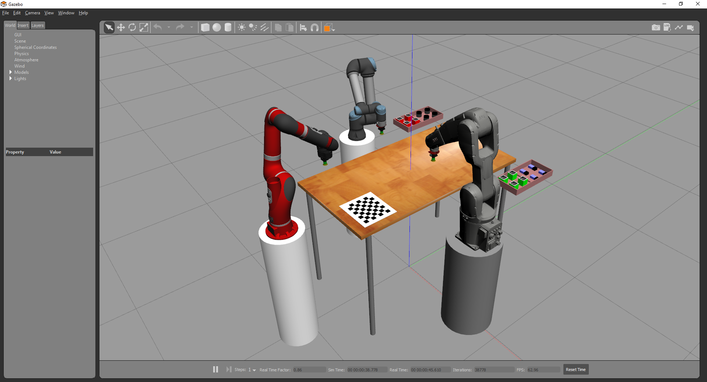
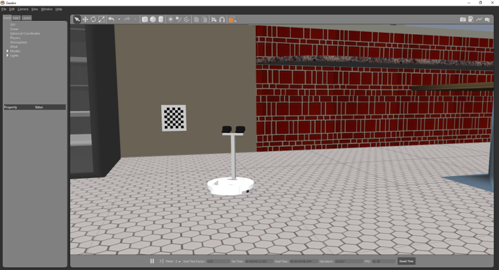

# Robot Raconteur Training Simulator

The Robot Raconteur Training Simulator is a Gazebo based simulator designed to help users learn Robot Raconteur.
It provides simulated devices and Robot Raconteur device drivers.

Table of Contents:

- [Introduction](#introduction)
- [Connection Info](#connection-info)
- [Installation](#installation)
- [Running the iRobot Create Simulation](#running-the-irobot-create-simulation)
- [Running the UR5e Simulation](#running-the-ur5e-simulation)
- [Running the Multi Robot Simulation](#running-the-multi-robot-simulation)
- [PyRI Programming Environment](#pyri-programming-environment)
- [Troubleshooting](#troubleshooting)

## Introduction

The Robot Raconteur Training Simulator is a Gazebo based simulator that contains three scenes:

**Universal Robot UR5e Scene**

* Two Universal Robots UR5e Robots
* Two simulated vacuum grippers
* An overhead simulated camera
* Small payloads to manipulate with robots
* Chessboard calibration target

**Multi Robot Scene**

* Three robots from different vendors:
  * Universal Robots UR5e Robot
  * ABB IRB 1200 5-90
  * ReThink Sawyer
* Three simulated vacuum grippers
* An overhead simulated camera
* Small payloads to manipulate with robots
* Chessboard calibration target

**iRobot Create Scene**

* iRobot Create
* Stereo camera mast on robot
* "Cafe" scene from Gazebo model library

## Connection Info

The training simulator provides multiple Robot Raconteur services. This section contains the default Robot Raconteur 
connection information for clients to connect to the service. Also see the 
[Robot Raconteur Service Browser](https://github.com/robotraconteur/RobotRaconteur_ServiceBrowser) to detect
services on the network. The services can be connected using a URL, Discovery, or Subscriptions. See the Robot Raconteur
documentation for more information on connecting to services.

### 2ur5e Scene Connection Info

* UR5e Robot 1
  * URL: `rr+tcp://localhost:52511?service=robot`
  * Device Name: `ur5e_robot`
  * Node Name: `ur5e1_robot`
  * Service Name: `robot`
  * Root Object Type: `com.robotraconteur.robotics.robot.Robot`
* UR5e Robot 2
  * URL: `rr+tcp://localhost:52512?service=robot`
  * Device Name: `ur5e_robot_2`
  * Node Name: `ur5e2_robot`
  * Service Name: `robot`
  * Root Object Type: `com.robotraconteur.robotics.robot.Robot`
* Gripper 1
  * URL: `rr+tcp://localhost:52521?service=gripper`
  * Device Name: `ur5e1_gripper`
  * Node Name: `ur5e1_gripper`
  * Service Name: `gripper`
  * Root Object Type: `com.robotraconteur.robotics.tool.Tool`
* Gripper 2
  * URL: `rr+tcp://localhost:52522?service=gripper`
  * Device Name: `ur5e2_gripper`
  * Node Name: `ur5e2_gripper`
  * Service Name: `gripper`
  * Root Object Type: `com.robotraconteur.robotics.tool.Tool`
* Camera
  * URL: `rr+tcp://localhost:59823?service=camera`
  * Device Name: `gazebo_camera`
  * Node Name: `com.robotraconteur.imaging.camera`
  * Service Name: `camera`
  * Root Object Type: `com.robotraconteur.imaging.Camera`
* Gazebo
  * URL: `rr+tcp://localhost:11346?service=GazeboServer`
  * Device Name: `gazebosim`
  * Node Name: `org.gazebosim.gazebo.GazeboServer`
  * Service Name: `GazeboServer`
  * Root Object Type: `org.gazebosim.gazebo.Server`

### Multi Robot Scene Connection Info

* UR5e Robot
  * URL: `rr+tcp://localhost:52511?service=robot`
  * Device Name: `ur5e_robot`
  * Node Name: `ur5e_robot`
  * Service Name: `robot`
  * Root Object Type: `com.robotraconteur.robotics.robot.Robot`
* ABB Robot
  * URL: `rr+tcp://localhost:52512?service=robot`
  * Device Name: `abb_robot`
  * Node Name: `abb_robot`
  * Service Name: `robot`
  * Root Object Type: `com.robotraconteur.robotics.robot.Robot`
* Sawyer Robot
  * URL: `rr+tcp://localhost:52513?service=robot`
  * Device Name: `sawyer_robot`
  * Node Name: `sawyer_robot`
  * Service Name: `robot`
  * Root Object Type: `com.robotraconteur.robotics.robot.Robot`
* Gripper 1
  * URL: `rr+tcp://localhost:52521?service=gripper`
  * Device Name: `ur5e_gripper`
  * Node Name: `ur5e_gripper`
  * Service Name: `gripper`
  * Root Object Type: `com.robotraconteur.robotics.tool.Tool`
* Gripper 2
  * URL: `rr+tcp://localhost:52522?service=gripper`
  * Device Name: `abb_gripper`
  * Node Name: `abb_gripper`
  * Service Name: `gripper`
  * Root Object Type: `com.robotraconteur.robotics.tool.Tool`
* Gripper 3
  * URL: `rr+tcp://localhost:52523?service=gripper`
  * Device Name: `sawyer_gripper`
  * Node Name: `sawyer_gripper`
  * Service Name: `gripper`
  * Root Object Type: `com.robotraconteur.robotics.tool.Tool`
* Camera
  * URL: `rr+tcp://localhost:59823?service=camera`
  * Device Name: `gazebo_camera`
  * Node Name: `com.robotraconteur.imaging.camera`
  * Service Name: `camera`
  * Root Object Type: `com.robotraconteur.imaging.Camera`

### iRobot Create Scene Connection Info

Use examples in https://github.com/robotraconteur/RobotRaconteur_Python_Examples to operate the iRobot Create
scene.

* Gazebo
  * URL: `rr+tcp://localhost:11346?service=GazeboServer`
  * Device Name: `gazebosim`
  * Node Name: `org.gazebosim.gazebo.GazeboServer`
  * Service Name: `GazeboServer`
  * Root Object Type: `org.gazebosim.gazebo.Server`

## Installation

### Windows

Download and install Miniforge for Python 3.11 from https://github.com/conda-forge/miniforge?tab=readme-ov-file#download .

Open the Miniforge3 prompt by clicking Start -> Miniforge3 ->  Miniforge Prompt

In the terminal, run the following to install the simulator:

    conda create -c conda-forge -c robotraconteur -c wasontech -n rr_training_sim robotraconteur_training_sim
    

### Linux

Download and install Miniforge for Python 3.11 from https://github.com/conda-forge/miniforge?tab=readme-ov-file#download .

The Linux installer will configure your system to start conda by default in new terminals. This can be disabled with the following command:

    conda config --set auto_activate_base false

In a new terminal, run the following to install the simulator:

    source ~/miniforge3/bin/activate
    conda create -c conda-forge -c robotraconteur -c wasontech -n rr_training_sim robotraconteur_training_sim

## Running the iRobot Create Simulation

The iRobot Create scene only contains the simulation. The simulated drivers are contained in the Python Examples
repository. See https://github.com/robotraconteur/RobotRaconteur_Python_Examples

### Windows

A shortcut is created in the Start menu on Windows. Click Start -> Robot Raconteur Training Sim -> RR Training Sim (create)

To run the simulation from the command line, open the Miniforge3 prompt by clicking Start -> Miniforge3 -> Miniforge Prompt

Run the following command:

    conda activate rr_training_sim
    run_create_sim

### Linux

Open a new prompt and run the following commands to run the simulation:

    source ~/miniforge3/bin/activate
    conda activate rr_training_sim
    run_create_sim

## Running the UR5e Simulation

### Windows

A shortcut is created in the Start menu on Windows. Click Start -> Robot Raconteur Training Sim -> RR Training Sim (2ur5e)

To run the simulation from the command line, open the Miniforge3 prompt by clicking Start -> Miniforge3 -> Miniforge Prompt

Run the following command:

    conda activate rr_training_sim
    run_2ur5e_sim   

### Linux

Open a new prompt and run the following commands to run the simulation:

    source ~/miniforge3/bin/activate
    conda activate rr_training_sim
    run_2ur5e_sim

### UR5e Example Scripts

The simulator comes with several Robot Raconteur driver client example scripts. In a terminal with the `rr_training_sim` conda environment active, such as the one used to start the simulator, run the following to cd to the directory containing the scripts:

Windows:

    cd %CONDA_PREFIX%\gz_example\example_scripts

Linux:

    cd $CONDA_PREFIX/gz_example/example_scripts

### Robot Motion Examples

*Jog example* `ur5_client_jog_freespace.py` - A client commanding the robot using the `jog_freespace` command.

    python ur5_client_jog_freespace.py

*Position command example* `ur5_client_position_command.py` - A client commanding the robot using the `position_command` wire member.

    python ur5_client_position_command.py

*Trajectory command example* `ur5_client_trajectory.py` - A client commanding the robot using the `execute_trajectory` member generator function.

    python ur5_client_trajectory.py

### Camera Client Examples

*Camera single frame synchronous capture* `camera_client_captureframe.py` - An example camera client that synchronously captures a frame from the overhead camera.

    python camera_client_captureframe.py

*Camera streaming* `camera_client_image.py` - An example camera client that streams a preview of the overhead camera.

## Running the Multi Robot Simulation

### Windows

A shortcut is created in the Start menu on Windows. Click Start -> Robot Raconteur Training Sim -> RR Training Sim (multi robot)

To run the simulation from the command line, open the Miniforge3 prompt by clicking Start -> Miniforge3 -> Miniforge Prompt

Run the following command:

    conda activate rr_training_sim
    run_multi_robot_sim   

### Linux

Open a new prompt and run the following commands to run the simulation:

    source ~/miniforge3/bin/activate
    conda activate rr_training_sim
    run_multi_robot_sim

## PyRI Programming Environment

The PyRI Open-Source Programming Environment and Teach Pendant can be used to operate and program the devices training simulator.
It can manipulate the robots, operate the tools, and read the camera. It can also program the robots using restricted 
Python and Blockly. See https://github.com/pyri-project/pyri-core/blob/master/README.md

 

 
 

## Troubleshooting

See the log files for the output of processes. On Windows, these are located at `%LOCALAPPDATA%\drekar-launch\drekar-launch\Logs` .
On Linux the logs are located at `$HOME/.cache/drekar-launch/log` .

*Gazebo won't start*

Sometimes `gzserver` fails to quit properly. On Linux, run `killall gzserver`. On Windows, use the Task Manager -> Details tab to kill `gzserver`.

*Gazebo or Drivers fail to start again after closing all windows*

Linux sockets have a behavior called `TIME_WAIT`, which means the socket will remain open for a few minutes after the program has exited. This can be checked using the command `netstat -an | grep TIME_WAIT`. Try waiting a few minutes before restarting the simulation, or reboot the computer.

*Connection Refused when trying to connect using a script*

Check to make sure the drivers have all opened properly. Check the log files to make sure that all the processes
are operating correctly. More debug information is available if the simulations are launched from the command line.
Check the connection info in the section above for the simulation. Real devices will have different connection URLs
and other values. Check the driver documentation for more information on connecting. Use the
[Robot Raconteur Service Browser](https://github.com/robotraconteur/RobotRaconteur_ServiceBrowser) 
to see if the driver is discoverable on the network. Try (temporarily) disabling the firewall if networking between
computers is being used.

