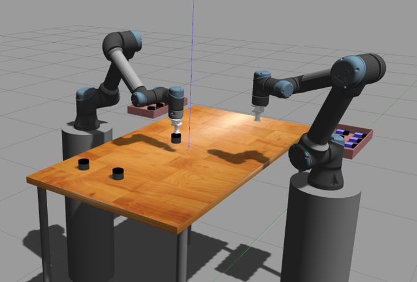

# Instruction
## Pre-installed:
* Simulation robot service (https://drive.google.com/file/d/1U-vyhtldd_YzLh6SE9Q6hHmyyGCCjbOp/view?usp=sharing & [dotnet runtime](https://docs.microsoft.com/en-us/dotnet/core/install/linux-ubuntu))
* Swig 4.0.2 or later

## ROS packages (to be built in catkin_ws):
* robotraconteur: https://github.com/robotraconteur/robotraconteur
* RobotRaconteur_Gazebo_Server_Plugin: https://github.com/johnwason/RobotRaconteur_Gazebo_Server_Plugin
* robotraconteur_standard_robdef_cpp: https://github.com/johnwason/robotraconteur_standard_robdef_cpp


* ros_link_attacher: https://github.com/johnwason/gazebo_ros_link_attacher
* ros_controllers: https://github.com/ros-controls/ros_controllers
* four_wheel_steering_msgs: http://wiki.ros.org/four_wheel_steering_msgs
* open_cv: https://github.com/ros-perception/vision_opencv


## python packages:
quadprog, cvxopt, pyquaternion, viscid, qpsolvers

## workspace build command (using catkin tools):
```
rosdep install --from-paths . --ignore-src --rosdistro noetic -y
catkin config --cmake-args -DROBOTRACONTEUR_ROS=1 -DCMAKE_BUILD_TYPE=Release
catkin build
```

## Path & Source
```
source /opt/ros/noetic/setup.bash
source ~/catkin_ws/devel/setup.bash

export PYTHONPATH=/usr/lib/python3.8/site-packages:${PYTHONPATH}
export GAZEBO_MODEL_PATH=~/RR_Project/simulation/models
export GAZEBO_PLUGIN_PATH=~/catkin_ws/devel/lib
```


## Running instructions


`roscore` to start a roscore for gazebo

`./start_gazebo` to start gazebo and RR_gazebo plugin only

`./start_all` to start everything

open separate terminals and run
`python client_pick_and_place.py --robot-name=<robot-name>`
